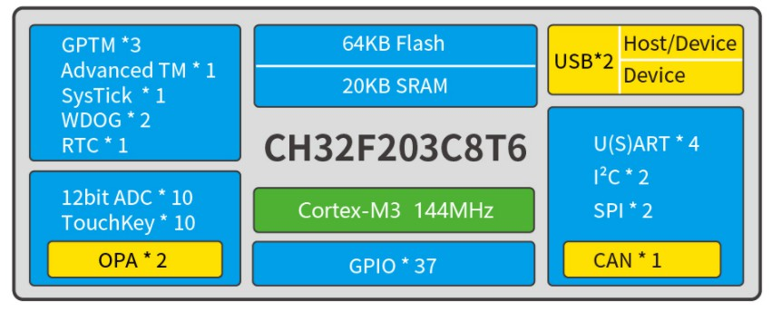

# 32-bit Enhanced Low-power Cortex-M3 MCU-CH32F203
EN | [中文](README_zh.md)

### Overview
CH32F203 series is an industrial-grade enhanced low-power general-purpose microcontroller designed based on 32-bit Cortex-M3 core, with high performance, supporting up to 144MHz system main frequency, low-power consumption, running at the highest system main frequency with power consumption as low as 69uA/MHz. CH32F203 integrates dual USB interfaces, supporting USB Host and USB Device functions, has 1 CAN interface (2.0B active), dual OPAs, 4 UARTs, dual I2C, 12-bit ADC, 10-channel Touchkey and other rich peripheral resources.

### System Block Diagram

 
### Features
- Cortex-M3 core, up to 144MHz system main frequency
- Single-cycle multiplication and hardware division support 20KB SRAM, 64KB Flash
- Power supply voltage: 2.5/3.3V, GPIO unit independent power supply
- Multiple low-power modes: Sleep, Stop, Standby
- Run mode as low as 69.3uA/MHz
- Sleep mode as low as 22.4uA/MHz
- Power on/off reset, programmable voltage detector
- 1 set of 8-channel general-purpose DMA controller
- 2 sets of op-amp comparators
- 10-channel 12-bit ADC conversion, 10-channel TouchKey
- 4 sets of timers
- 1 USB2.0 full-speed host/device interface
- 1 USB 2.0 full-speed device interface
- 4 U(S)ART interfaces
- 1 CAN interface (2.0B active)
- 2 sets of I2C interfaces, 2 sets of SPI interfaces
- 37 I/O ports, can be mapped to 16 external interrupts
- CRC calculation unit, 96-bit chip unique ID
- 2-wire serial debug interface (SDW)
- Package: LQFP48, LQFP32

# 32-bit Wireless Cortex-M3 MCU - CH32F208

### Overview
The CH32F208 is a wireless MCU based on the Cortex-M3 core. The system clock frequency can be up to 144MHz. The CH32F208 integrates 2Mbps Bluetooth Low Energy communication module, 10M Ethernet module (MAC+PHY), USB2.0 full-speed device interface and host/device interface, CAN controller, etc

### System Block Diagram

### Features
- Cortex-M3 core, up to 144MHz system clock frequency;
- Single-cycle multiplication and hardware division;
- 64KB SRAM, 128KB Flash;
- Supply voltage: 2.5/3.3V. GPIO unit is supplied independently;
- Low-power modes: sleep, stop, standby;
- Bluetooth Low Energy 5.3;
- 10M Ethernet controller (MAC+PHY);
- Power-on/power-down reset, programmable voltage detector;
- 2 op amp comparators;
- 16-channel 12-bit ADC converter, 16-channel TouchKey;
- 5 timers;
- USB2.0 full-speed host/device + device interface;
- 4 USARTs;
- One CAN interface (2.0B active);
- 2 IIC interfaces, 2 SPI interfaces;
- 53 I/O ports, can be mapped to 16 external interrupts;
- CRC calculation unit, 96-bit unique ID;
- Serial 2-wire debug interface;
- Packages: LQFP64M, QFN68;

