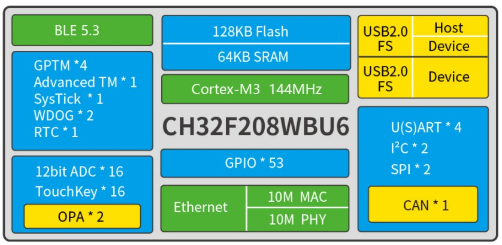

# 32位增强型低功耗Cortex-M3单片机 CH32F203

[EN](README.md) | 中文

### 概述

CH32F203系列是基于32位Cortex-M3内核设计的工业级增强型低功耗通用微控制器，高性能，最高支持144MHz系统主频，低功耗，最高系统主频下运行功耗低至69uA/MHz。CH32F203集成双路USB接口，支持USB Host主机及USB Device设备功能，具有1路CAN接口（2.0B主动）、双路OPA运放、4组UART、双路IIC，12位ADC，10路Touchkey等丰富外设资源。

### 系统框图

### 产品特点

- Cortex-M3内核，最高144MHz系统主频
- 支持单周期乘法和硬件除法
- 20KB SRAM，64KB Flash
- 供电电压：2.5/3.3V，GPIO单元独立供电
- 多种低功耗模式：睡眠、停止、待机
- 运行模式低至69.3uA/MHz
- 睡眠模式低至22.4uA/MHz
- 上/下电复位、可编程电压监测器
- 1组8路通用DMA控制器
- 2组运放比较器
- 10通道12位ADC转换，10路触摸按键TouchKey
- 4组定时器
- 1个USB2.0 全速主机/设备接口
- 1个USB2.0 全速设备接口
- 4个U(S)ART接口
- 1个CAN接口（2.0B主动）
- 2组IIC接口、2组SPI接口
- 37个I/O口，可以映射到16个外部中断
- CRC计算单元，96位芯片唯一ID
- 串行2线调试接口
- 封装形式：LQFP48、LQFP32
# 32位无线型Cortex-M3单片机 CH32F208

### 概述

CH32F208系列是基于Cortex-M3内核设计的无线型微控制器，此系列主频高达144MHz。片上集成2Mbps低功耗蓝牙BLE 通讯模块、10M以太网MAC+PHY模块、USB2.0全速设备+主机/设备接口、CAN控制器等。

### 系统框图

### 产品特点

- Cortex-M3内核，最高144MHz系统主频
- 支持单周期乘法和硬件除法
- 64KB SRAM，128KB Flash
- 供电电压：2.5/3.3V，GPIO单元独立供电
- 多种低功耗模式：睡眠、停止、待机
- 低功耗蓝牙5.3
- 10M以太网控制器（MAC+PHY）
- 上/下电复位、可编程电压监测器
- 2组运放比较器
- 16通道12位ADC转换，16路触摸按键TouchKey
- 5组定时器
- USB2.0全速主机/设备+设备接口
- 4个USART接口
- 1个CAN接口（2.0B主动）
- 2组IIC接口、2组SPI接口
- 53个I/O口，可以映射到16外部中断
- CRC计算单元，96位芯片唯一ID
- 串行2线调试接口
- 封装形式：LQFP64M、QFN68
